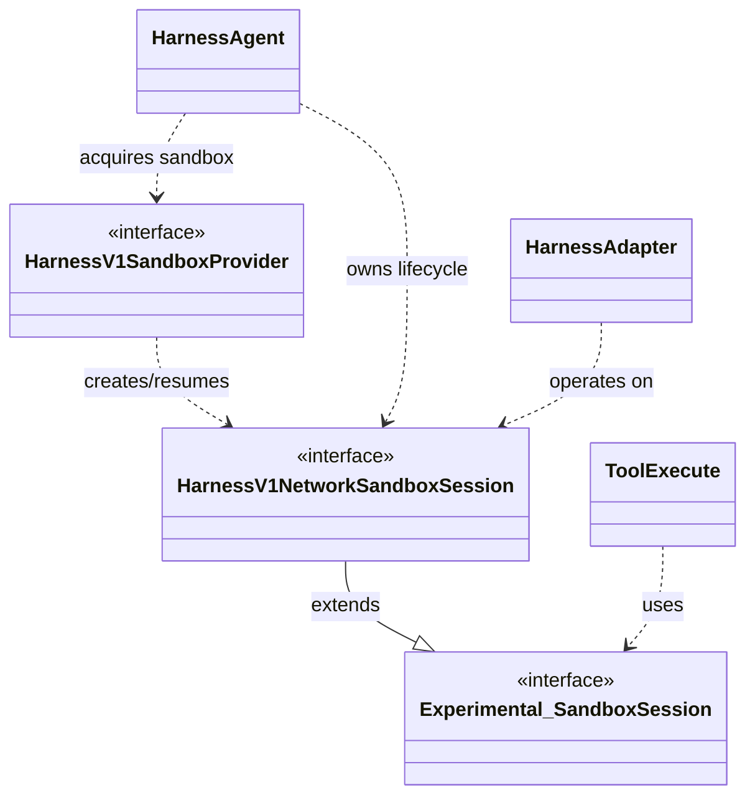
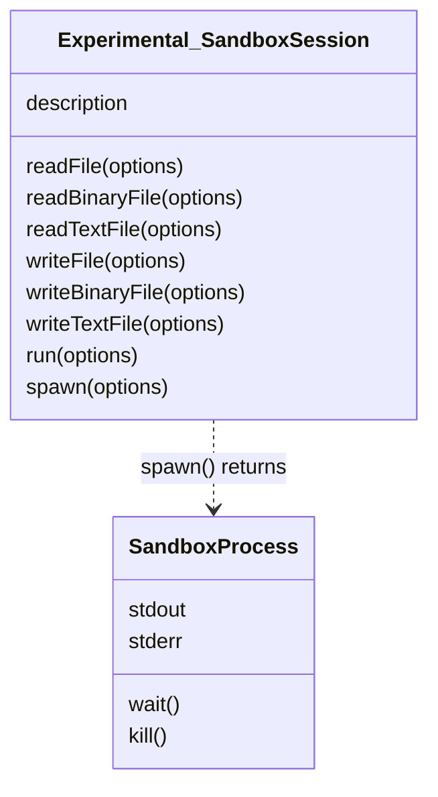
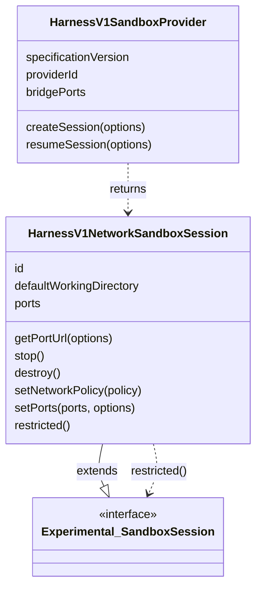
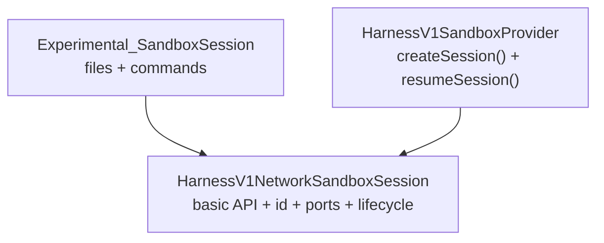
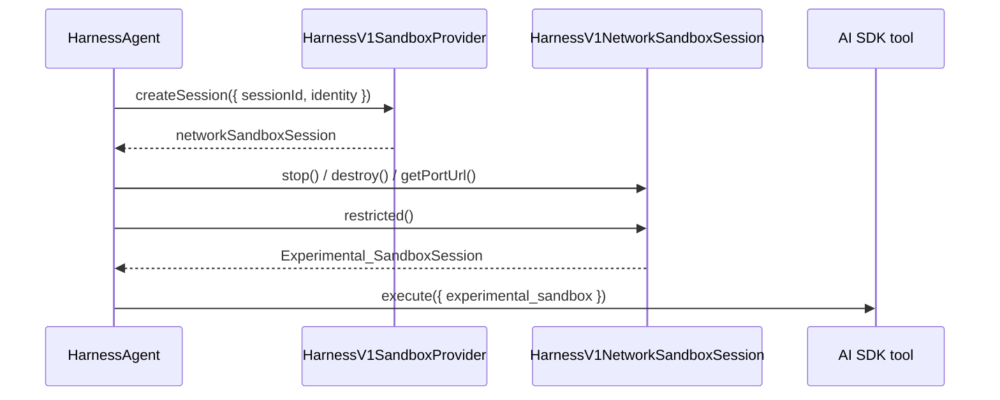

# Sandbox Abstraction Architecture

This document explains the two-tier sandbox abstraction in the AI SDK.
It starts with the basic sandbox session surface and then describes the harness-specific layer.

## High-Level Architecture

- **Basic sandbox session**: `Experimental_SandboxSession`
- **Network sandbox session**: `HarnessV1NetworkSandboxSession`, an extension of `Experimental_SandboxSession`
- **Sandbox provider**: `HarnessV1SandboxProvider`
- **Consumers**: AI SDK tools, `HarnessAgent`, and harness adapters



The basic layer is the file and process API.
The harness layer adds resource identity, port resolution, lifecycle, and provider-managed creation/resume.

## Basic Layer: `Experimental_SandboxSession`

Implement this layer when the sandbox only needs to support tools that operate on the sandbox.

- `description`
- `readFile()`, `readBinaryFile()`, `readTextFile()`
  - `readBinaryFile()` and `readTextFile()` can be implemented to wrap `readFile()`, unless dedicated methods exist in the underlying sandbox SDK
- `writeFile()`, `writeBinaryFile()`, `writeTextFile()`
  - `writeBinaryFile()` and `writeTextFile()` can be implemented to wrap `writeFile()`, unless dedicated methods exist in the underlying sandbox SDK
- `spawn()`, `run()`
  - `run()` can be implemented to wrap `spawn()`, unless a dedicated method exists in the underlying sandbox SDK



### Basic Use Cases

- AI SDK tool execution with `experimental_sandbox`
- host-driven agents that use a sandbox as a remote filesystem and shell
- examples and local adapters that do not need network ports or sandbox lifecycle

```ts
import type { Experimental_SandboxSession } from 'ai';

async function inspectPackageJson({
  sandbox,
}: {
  sandbox: Experimental_SandboxSession;
}) {
  return sandbox.readTextFile({ path: 'package.json' });
}
```

The basic layer does not describe how the sandbox is created, stopped, destroyed, resumed, or exposed over a network.

## Advanced Layer: Harness Network Sandbox

Implement this layer when the sandbox should support `HarnessAgent`.

- `HarnessV1NetworkSandboxSession` extends `Experimental_SandboxSession`
- `HarnessV1SandboxProvider` creates and resumes network sandbox sessions
- `restricted()` narrows a network sandbox session back to the basic sandbox surface
  - this is crucial for passing the sandbox to tool execution functions, to prevent the tools from calling advanced network sandbox methods they are not allowed to use



It is recommended that you implement this sandbox layer decoupled from the basic sandbox layer. Ideally the advanced layer extends the basic layer, but allows to use the basic layer on its own. That way the sandbox implementation satisfies both use-cases efficiently.

### Advanced Use Cases

- `HarnessAgent` sessions
- bridge-backed harness adapters that need a sandbox-exposed WebSocket port
- persistent or resumable sandbox resources
- provider-managed bootstrap caching via `identity` and `onFirstCreate`

```ts
import type {
  HarnessV1NetworkSandboxSession,
  HarnessV1SandboxProvider,
} from '@ai-sdk/harness';

type CreateSessionOptions = NonNullable<
  Parameters<HarnessV1SandboxProvider['createSession']>[0]
>;

class DockerSandboxProvider implements HarnessV1SandboxProvider {
  readonly specificationVersion = 'harness-sandbox-v1' as const;
  readonly providerId = 'docker-sandbox';

  async createSession(
    options: CreateSessionOptions = {},
  ): Promise<HarnessV1NetworkSandboxSession> {
    const image = await prepareDockerImage({
      identity: options.identity,
      onFirstCreate: options.onFirstCreate,
      abortSignal: options.abortSignal,
    });

    return createDockerContainer({
      image,
      sessionId: options.sessionId,
      abortSignal: options.abortSignal,
    });
  }
}
```

## Relationship Between the Layers

The advanced layer is additive.
Every `HarnessV1NetworkSandboxSession` is also an `Experimental_SandboxSession`.



`restricted()` is the boundary between infrastructure code and user/tool code.
`HarnessAgent` owns the network sandbox session, while host-executed tools receive only the restricted basic session.



## Harness and Sandbox Interaction

See [Harness and Sandbox Interaction](./harness-abstraction.md#harness-and-sandbox-interaction).

## Choosing a Layer

Use the basic layer when:

- the caller already has a sandbox session;
- no port URL is needed;
- no harness session lifecycle is needed;
- the sandbox is passed to tools as `experimental_sandbox`.

Use the advanced layer when:

- the sandbox is passed to `HarnessAgent`;
- the adapter needs a public URL for an in-sandbox bridge;
- the sandbox must be stopped, destroyed, or resumed by `sessionId`;
- bootstrap setup should be cached by `identity`.

## Reference Implementations

- Basic session API - [`packages/provider-utils/src/types/sandbox.ts`](../packages/provider-utils/src/types/sandbox.ts)
- Network session API - [`packages/harness/src/v1/harness-v1-network-sandbox-session.ts`](../packages/harness/src/v1/harness-v1-network-sandbox-session.ts)
- Sandbox provider API - [`packages/harness/src/v1/harness-v1-sandbox-provider.ts`](../packages/harness/src/v1/harness-v1-sandbox-provider.ts)
- Vercel sandbox provider - [`packages/sandbox-vercel/src/vercel-sandbox.ts`](../packages/sandbox-vercel/src/vercel-sandbox.ts)
- Just Bash sandbox provider - [`packages/sandbox-just-bash/src/just-bash-sandbox.ts`](../packages/sandbox-just-bash/src/just-bash-sandbox.ts)
